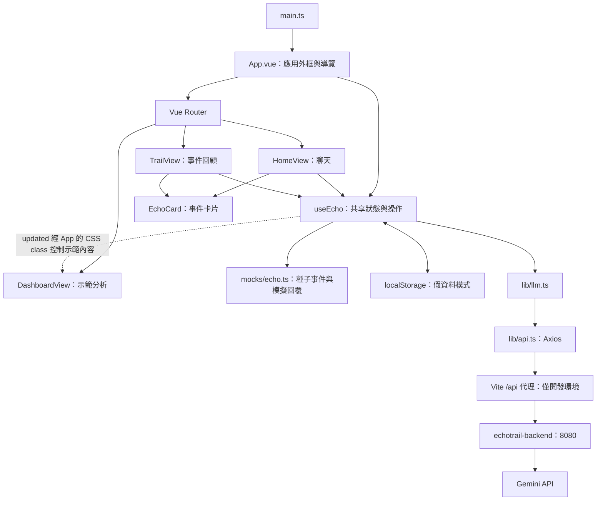

# EchoTrail 前端架構說明

本文件依 2026-09-13 工作區現況整理，包含尚未提交的實作。EchoTrail 是 Vue 單頁應用：以聊天整理個人經驗，產生 Echo Card，再透過 My Trail 回顧事件與 Dashboard 查看示範分析。

目前預設保留假資料體驗，也可切換 Gemini 即時文字對話。Gemini 對話、Echo Card 與 Dashboard 訊號已串成完整本機展示流程；資料仍只保存在瀏覽器，沒有正式帳號或雲端事件儲存。

## 1. 整體架構

## 2. 技術與責任分層

| 層級       | 使用技術／位置                                 | 責任                                                      |
| ---------- | ---------------------------------------------- | --------------------------------------------------------- |
| 應用啟動   | Vue 3、TypeScript；`src/main.ts`               | 載入全域樣式、安裝 Router、掛載 App                       |
| 外框與路由 | `App.vue`、Vue Router                          | 側欄、導覽、新對話、重設確認、頁面切換                    |
| 頁面       | `src/views/`                                   | 組合功能元件、處理頁面互動與暫態 UI                       |
| 共用元件   | `src/components/`                              | Echo Card 呈現、基礎 Button                               |
| 狀態與流程 | `src/composables/useEcho.ts`                   | 對話、模式切換、事件儲存、持久化、錯誤處理                |
| 資料與型別 | `src/mocks/echo.ts`                            | 種子事件、示範輸入、mock 回覆、Message 與 TrailEvent 型別 |
| HTTP       | Axios；`src/lib/api.ts`、`llm.ts`              | 共用連線設定與 LLM 請求／回應轉換                         |
| 樣式       | Tailwind CSS、shadcn-vue、CSS                  | 語意色、基礎元件樣式、產品版面與響應式規則                |
| 開發與驗證 | Vite、Vitest、Vue Test Utils、ESLint、Prettier | 本機伺服器、建置、測試與品質檢查                          |

## 3. 頁面與元件

| 路由         | 頁面          | 功能與狀態來源                                                                     |
| ------------ | ------------- | ---------------------------------------------------------------------------------- |
| `/`          | HomeView      | 輸入與對話、示範入口、Gemini 切換、產生卡片、儲存後導向 Dashboard；使用 useEcho    |
| `/trail`     | TrailView     | V1 顯示事件 6；V2 展開季度、事件選擇、重新討論；事件來自 useEcho                   |
| `/dashboard` | DashboardView | V1 顯示硬／軟實力、RIASEC、DISC；V2 展開 Persona 等示範分析；內容主要寫在 template |
| 其他路徑     | 重新導向首頁  | 避免未知網址停在空頁                                                               |

首頁直接載入；Trail 與 Dashboard 使用動態 import 延遲載入。Router 採 history 模式。

`App.vue` 保留共用外框，以 `RouterView` 顯示頁面。`EchoCard.vue` 接收具型別的 `event` prop，透過預設 slot 放入儲存按鈕等附加內容，本身不負責 API 或儲存。基礎 Button 放在 `components/ui/button/`，採 shadcn-vue／Reka UI 與變體設定。

## 4. 狀態管理與資料模型

目前沒有 Pinia。`useEcho.ts` 在模組頂層建立 `reactive`、`ref` 與 `computed`；不同元件呼叫 `useEcho()` 時，取得同一份共享狀態。

| 狀態                            | 內容                                                           |
| ------------------------------- | -------------------------------------------------------------- |
| `state.events`                  | 新增或覆寫的事件，不包含未修改的種子事件                       |
| `state.messages`、`state.draft` | 目前模式的訊息與輸入草稿                                       |
| `state.insight`                 | 本次產生的 Echo Card，尚未儲存時也存在                         |
| `state.sourceId`                | 重新討論的來源事件 ID，儲存時用來更新既有事件                  |
| `live`                          | 是否使用 Gemini；預設 false                                    |
| `status`                        | busy、storageError、error                                      |
| `allEvents`                     | 合併六筆種子事件與儲存事件，同 ID 以儲存版本取代，再依 ID 排序 |
| `updated`、`saved`              | 是否已有儲存事件，以及當前卡片是否與已儲存版本相同             |

`Message` 包含 `role: 'user' | 'echo'` 與 `text`。`TrailEvent` 包含 ID、標題、日期、季度、事件描述、情緒、喜好／擅長、不適合、價值主張、引證原話、選用的 `isNew`，以及 grounded Dashboard signals。

頁面的季度選擇、選中事件與對話輸入框參照留在各頁。Dashboard 的框架切換不持久化。

## 5. 主要資料流

### 假資料模式

1. 使用者輸入或選擇示範文字，更新 `state.draft`。
2. `send()` 加入使用者訊息，呼叫 `mockReply()` 產生模擬回覆。
3. `generateInsight()` 以示範分析欄位建立卡片；事件描述與引證原話取自對話。
4. `saveInsight()` 依事件 ID 新增或取代 `state.events` 的資料，再導向 Dashboard。
5. My Trail 從 `allEvents` 取得合併後事件。重新討論會保留來源 ID，後續儲存更新原事件。

假資料產卡會附上三筆固定訊號，讓無後端環境仍可驗證 Dashboard 聚合與證據呈現。

### Gemini 模式

1. 切換模式時，分別保留 mock 與 live 的對話、草稿及卡片上下文；切換本身不呼叫 API。
2. `send()` 將目前對話交給 `chatLlm()`，把前端 `echo` 角色轉成 API 的 `model`。
3. Axios 呼叫 `POST /api/llm/chat`，本機經 Vite 代理到 `echotrail-backend`，再由 backend 呼叫 Gemini。
4. 成功後加入模型回覆；失敗則移除本次送出的訊息並恢復草稿，讓使用者手動重試。
5. `generateInsight()` 呼叫 `POST /api/llm/insight`，取得 Echo Card 與 grounded signals；後端負責格式、維度與逐字引用驗證。
6. `saveInsight()` 將結果加入事件集合；Dashboard 依框架與維度聚合平均分數並列出證據帳本。

送出與產卡期間以 `busy` 防止重複操作與模式切換。Gemini 對話及其新事件保留在記憶體，重新整理後消失。

### 持久化

假資料狀態透過深層 watch 同步寫入 `localStorage` 的 `echotrail-demo-v1`。啟動時讀取並驗證基本結構；資料損壞或讀取失敗則回到初始狀態。寫入失敗會顯示提示，仍允許當次操作。Gemini 模式跳過持久化。

## 6. API 與部署邊界

| 項目          | 現況                                                          |
| ------------- | ------------------------------------------------------------- |
| 共用 base URL | `VITE_API_BASE_URL`，預設 `/api`                              |
| Timeout       | Axios 預設 15 秒；聊天 30 秒、產卡 60 秒                      |
| 對話 API      | `POST /llm/chat`，輸入 messages，成功回傳 `{ text }`          |
| 產卡 API      | `POST /llm/insight`，回傳 Echo Card 與 grounded signals       |
| 本機前端      | Vite `127.0.0.1:5173`，將 `/api` 代理至 backend `127.0.0.1:8080` |
| LLM 服務      | `echotrail-backend` 的 Fastify API；金鑰與 prompts 留在後端環境變數 |
| 正式前端產物  | `npm run build` 執行型別檢查與 Vite 建置，輸出 `dist/`        |

LLM API 已移至獨立 `echotrail-backend` repository。`server/` 是此 repository 內的本機 Gemini 測試服務，沒有正式使用者驗證，不等同正式後端。

正式前端產物部署至 Firebase Hosting。Hosting 將 `/api/**` 轉送到 `asia-east1` 的 `echotrail-backend` Cloud Run service；其他不存在的前端路徑回傳 `index.html`。前端維持 `VITE_API_BASE_URL=/api`；Vite proxy 只用於本機開發，不會隨 `dist/` 部署。

Cloud Run 目前允許未驗證請求；正式部署仍需補上使用者認證與授權。

## 7. 檔案導覽與既有驗證

- `src/assets/main.css`：Tailwind、語意色與全域基礎樣式，另載入 `prototype.css`、`echo.css`。
- `src/assets/prototype.css`、`echo.css`：產品版面、展示狀態與響應式樣式。
- `src/__tests__/echo.spec.ts`：模式隔離、請求失敗恢復、真實產卡資料映射、儲存與持久化、防重送、重新討論與重設。
- `src/__tests__/App.spec.ts`：未知路由導向首頁。
- `docs/specs/dashboard.md`、`my-trail.md`、`gemini-connection.md`：各功能的版本範圍與契約。

程式變更依專案規則執行 lint、type-check、format:check；重要流程執行 Vitest，建置相關修改執行 build。真實 Gemini 穩定性由 backend 的 `npm run test:gemini` 驗證。
