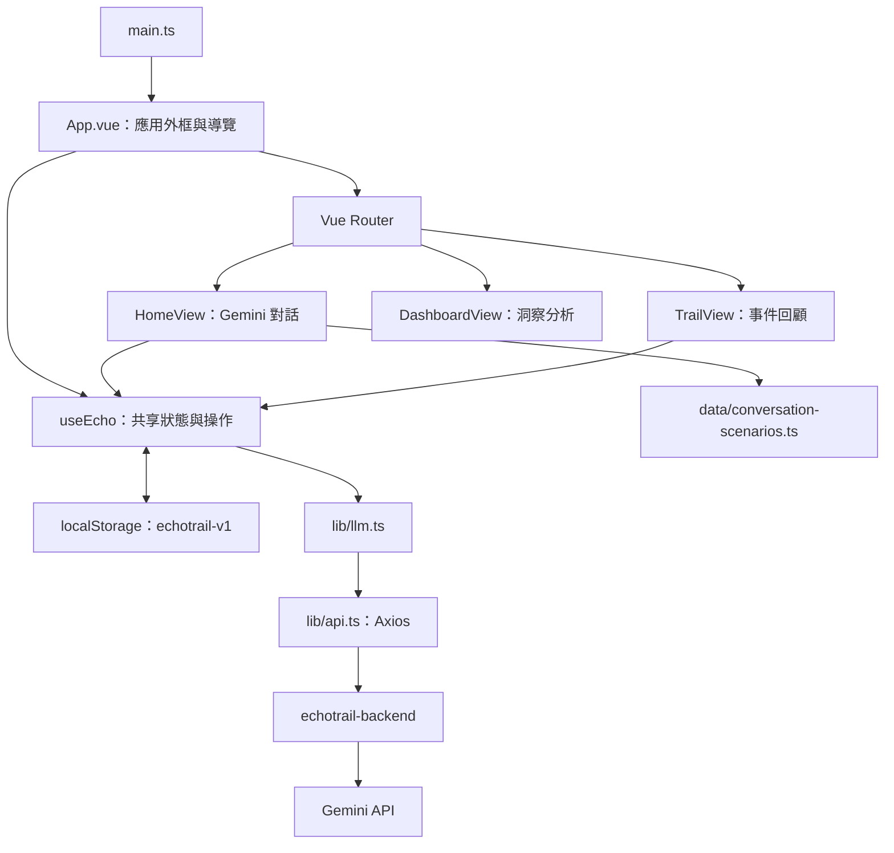

# EchoTrail 前端架構說明

EchoTrail 是 Vue 單頁應用：使用者與 Gemini 對話、產生 Echo Card，再透過 My Trail 回顧事件，並在 Dashboard 查看有原句依據的分析。前端不包含種子事件、模擬回覆或固定分析結果；資料目前保存在瀏覽器，尚未串接正式帳號或雲端事件儲存。

## 1. 整體架構

## 2. 技術與責任分層

| 層級 | 位置 | 責任 |
| --- | --- | --- |
| 應用啟動 | `src/main.ts` | 載入全域樣式、Router 與 App |
| 外框與路由 | `src/App.vue`、`src/router/` | 導覽、新對話、清除本機資料與頁面切換 |
| 頁面 | `src/views/` | 對話、事件回顧與 Dashboard 互動 |
| 狀態與流程 | `src/composables/useEcho.ts` | Gemini 對話、產卡、事件儲存、持久化與錯誤處理 |
| 情境腳本 | `src/data/conversation-scenarios.ts` | 三組正式的三輪快速體驗內容 |
| 領域型別 | `src/types/echo.ts` | Message、TrailEvent、DashboardProfile 與 signals |
| HTTP | `src/lib/api.ts`、`src/lib/llm.ts` | 共用連線設定與 LLM 請求／回應轉換 |
| 共用元件 | `src/components/` | Echo Card、圖表與基礎 UI |

## 3. 頁面

| 路由 | 功能 |
| --- | --- |
| `/` | 直接使用 Gemini 對話；可自行輸入或選擇三輪情境，產卡後儲存至 Dashboard |
| `/trail` | 顯示所有已儲存事件、預設最新一筆並切換事件詳情 |
| `/dashboard` | 聚合 Gemini 回傳的 Persona、職涯錨、關鍵字、行為模式與框架 signals |
| 其他路徑 | 重新導向首頁 |

首頁的固定情境只負責帶入使用者訊息；每一輪回覆、Echo Card 與 Dashboard profile 都由 backend 呼叫 Gemini 產生。

## 4. 狀態與資料模型

`useEcho.ts` 在模組頂層建立共享的 reactive state，不使用 Pinia。

| 狀態 | 內容 |
| --- | --- |
| `state.events` | 已儲存的 Gemini Echo Card |
| `state.messages`、`state.draft` | 當前對話與草稿 |
| `state.insight` | 本次 Gemini 產生、可能尚未儲存的 Echo Card |
| `state.sourceId` | 當前已儲存卡片的事件 ID |
| `status` | busy、storageError、error |
| `allEvents` | 依 ID 排序的已儲存事件 |
| `saved` | 當前卡片是否已儲存 |

每筆 `TrailEvent` 都必須同時包含 Gemini 回傳的 `dashboard` 與 `signals`，因此 Dashboard 不提供固定 fallback。無資料時由頁面顯示空狀態。

## 5. 主要資料流

1. `send()` 將目前逐字稿交給 `chatLlm()`，前端的 `echo` 角色在 API 邊界轉成 `model`。
2. `POST /api/llm/chat` 成功後加入 Gemini 回覆；失敗時移除本次訊息並恢復草稿。
3. `generateInsight()` 呼叫 `POST /api/llm/insight`，取得 Echo Card、Dashboard profile 與 grounded signals。
4. `saveInsight()` 儲存事件；同一段對話再次產卡時會更新原事件。
5. Dashboard 聚合所有事件的 Gemini 結果，My Trail 顯示同一份事件集合。

送出與產卡期間以 `busy` 防止重複操作。單則訊息最多 2,000 字，每段對話最多 16 輪。

## 6. 持久化

共享狀態透過深層 watch 寫入 localStorage 的 `echotrail-v1`。啟動時會驗證事件、對話、Dashboard 與 signals 結構；資料損壞或格式不符時回到空狀態。舊的 `echotrail-demo-v1` 不再讀取，因此既有示範事件不會出現在正式畫面。

## 7. API 與部署邊界

| 項目 | 現況 |
| --- | --- |
| 共用 base URL | `VITE_API_BASE_URL`，預設 `/api` |
| 對話 API | `POST /llm/chat`，逾時 30 秒 |
| 產卡 API | `POST /llm/insight`，逾時 60 秒 |
| 本機代理 | Vite 將 `/api` 代理至 `echotrail-backend` |
| 正式部署 | Firebase Hosting 將 `/api/**` 轉送至 Cloud Run |

LLM 金鑰與 prompts 只存在 backend。前端的 `VITE_*` 設定會公開於瀏覽器，不可放置機密。

## 8. 驗證

- `src/__tests__/echo.spec.ts`：情境完整性、Gemini 預設流程、失敗恢復、產卡儲存與清除。
- `src/__tests__/App.spec.ts`：未知路由導向首頁。
- 程式變更執行 lint、type-check、format:check 與 Vitest；建置相關修改執行 build。
- 真實 Gemini 穩定性由 backend 的 `npm run test:gemini` 驗證。
